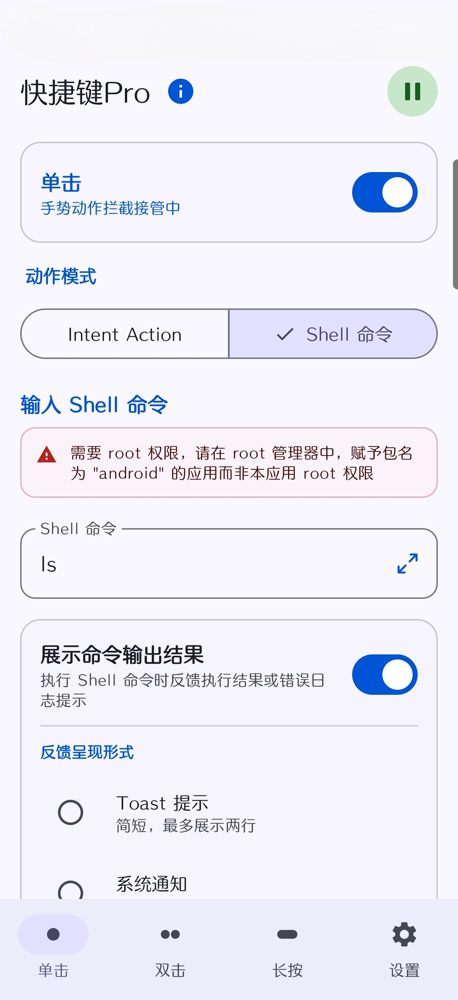
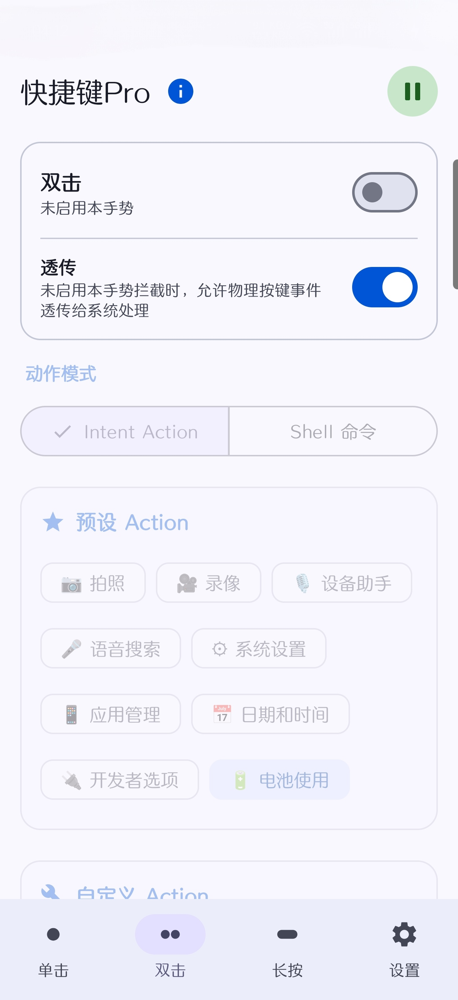
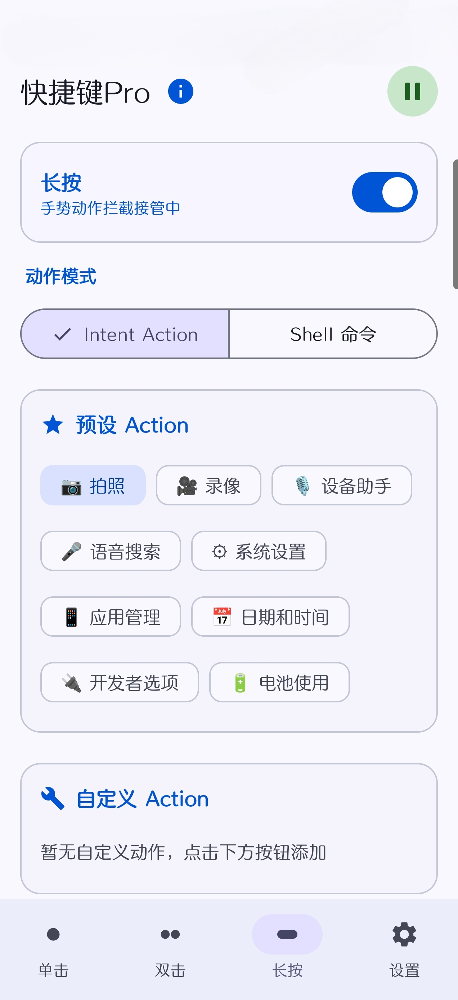
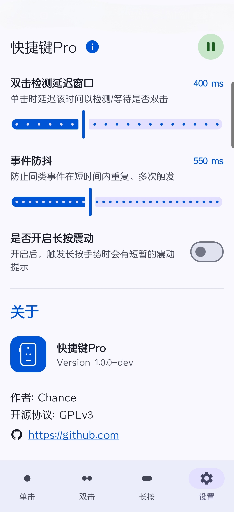

# ActionButtonPro (一加 15 快捷键自定义 Xposed 模块)

**快捷键 Pro (ActionButtonPro)** 是一款专为 **一加 15 (OnePlus 15) ColorOS 16** 打造的物理快捷键（Action Button）深度定制工具。因为快捷键比较特殊，一般的按键映射工具要么监听不到该快捷键，要么面临进程被杀和重启后熄火的问题。该模块通过在系统进程对快捷键的按键事件进行拦截与重定向，不用保活 app 也能稳定运行。

---

## 🌟 功能特点

1. **三种手势独立配置**：支持单击 (Single Tap)、双击 (Double Tap)、长按 (Long Press) 独立配置与控制。
2. **可选动作类型**：
   - **Intent Action**：支持预设快捷操作（如一键拍照、一键录像、语音搜索等），以及自定义 Intent Action。
   - **Shell 命令**：支持 Root 权限执行自定义 Shell 脚本指令。

---

## 📸 软件截图

| 单击配置 (Single) | 双击配置 (Double) | 长按配置 (Long) | 高级设置 (Settings) |
| :---: | :---: | :---: | :---: |
|  |  |  |  |

---

## 🚀 安装与使用指南

### 前提条件
* 手机已获取 Root 权限（推荐 Magisk、KernelSU 或 APatch）。
* 已安装并激活 **LSPosed**（或同等兼容的 Xposed 框架管理器）。

### 部署步骤
1. 下载并安装 **ActionButtonPro** 的最新版 APK。
2. 打开 LSPosed 管理器，找到本模块并**启用**。
3. **推荐作用域**：勾选 **系统框架**（包名 `system`）。
4. **重启手机** 或软重启使 Hook 注入生效。
5. 打开 ActionButtonPro 主界面，分别切换到 **单击**、**双击**、**长按** 标签，配置想要触发的动作。记得把右上角总开关打开。

---

## ⚠️ 使用须知 & 免责声明

* **使用须知**：
  1. **系统设置前置**：您必须先在系统快捷键设置里选择并启用任意一个功能项，否则系统将根本不会发出任何按键事件，本应用也将无法触发或拦截该按键！
  2. **防砖建议**：在尝试安装和激活本模块前，请确保您手机中重要数据已妥善备份。强烈建议您提前在 Magisk/KernelSU 中刷入防变砖模块，以便在出现问题时能进行挽救。
* **免责声明**：本软件涉及系统底层定制。任何底层修改均存在潜在风险，包括但不限于设备不稳定、系统无限重启（卡开机）或变砖。作者不对因使用本软件造成的任何设备故障、数据丢失或其它损失承担任何责任，请自行承担风险并谨慎使用！
